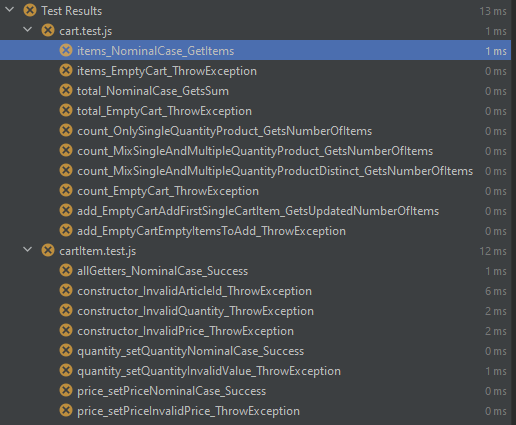

# README

# RIA1_TDD_TRAINING

RIA1_TDD_TRAINING est un projet permettant re-entraîner les compétences JS en favorisant une approche TDD et OOP.

## Installation

Pré-requis :

* npm 10.4.0 ou ultérieure [official doc](https://docs.npmjs.com/try-the-latest-stable-version-of-npm)
* node v20.11.0 ou ultérieure [official doc][https://nodejs.org/en/download]
* git version 2.43.0.windows ou ultérieure [official doc](https://git-scm.com/)

Note : configuration testée et validée sur l'IDE WebStorm : version 2023.3.2

## Récupérer le code

* Réaliser un fork via les outils en ligne de github
* Cloner le dépôt en local
* Ajouter une référence à votre propre dépôt (pour recevoir des mises à jour ou des correctifs)

* [How to fork on Github](https://docs.github.com/en/pull-requests/collaborating-with-pull-requests/working-with-forks/fork-a-repo)

Après avoir récupéré le référentiel:

```
  [INPUT]
  npm install
  
  [OUTPUT]
  npm install  

  up to date, audited 288 packages in 964ms
  
  30 packages are looking for funding
    run `npm fund` for details
  
  found 0 vulnerabilities
```

## Webstorm

* [Jest](https://www.jetbrains.com/help/webstorm/running-unit-tests-on-jest.html#ws_node_test_docker)
* [Debug Test](https://www.jetbrains.com/help/webstorm/running-unit-tests-on-jest.html#ws_jest_debugging_tests)
* [Code Coverage](https://www.jetbrains.com/help/webstorm/running-unit-tests-on-jest.html#ws_jest_code_coverage)

```
In Preferences | Languages & Frameworks | JavaScript | Libraries, press Download..., select 'jest' from the list of available stubs, press Download and Install
```

## Utilisation

Pour tester tout le projet :

```bash
    [INPUT]
    npm run test
    
    [EXPECTED OUTPUT AT THE END OF THE PROJECT]
    > ria1_tdd_training@1.0.0 test
    > jest

    PASS  src/test/cart.test.js
    PASS  src/test/cartItem.test.js
    
    Test Suites: 2 passed, 2 total
    Tests:       18 passed, 18 total
    Snapshots:   0 total
    Time:        0.424 s, estimated 1 s
    Ran all test suites.
```

Pour lancer les tests d'un seul fichier :

```bash
    npm test [pathToTestFile.js]
    
    [INPUT]
    npm run test test/cart.test.js
    
    [OUTPUT]
    > ria1_tdd_training@1.0.0 test
    > jest test/cart.test.js
    
     PASS  src/test/cart.test.js
      √ items_NominalCase_GetItems (3 ms)
      √ items_EmptyCart_ThrowException (10 ms)
      √ total_NominalCase_GetsSum (1 ms)
      √ total_EmptyCart_ThrowException (1 ms)
      √ count_OnlySingleQuantityProduct_GetsNumberOfItems (1 ms)
      √ count_MixSingleAndMultipleQuantityProduct_GetsNumberOfItems
      √ count_MixSingleAndMultipleQuantityProductDistinct_GetsNumberOfItems
      √ count_EmptyCart_ThrowException
      √ add_EmptyCartAddFirstSingleCartItem_GetsUpdatedNumberOfItems
      √ add_EmptyCartEmptyItemsToAdd_ThrowException (2 ms)
    
    Test Suites: 1 passed, 1 total
    Tests:       10 passed, 10 total
    Snapshots:   0 total
    Time:        0.447 s
    Ran all test suites matching /test\\cart.test.js/i.
```

Pour lancer les tests d'un seul fichier :

```
    npm test [pathToTestFile.js]
    
```


Le résultat a obtenir en début de projet :



Pour tester une seule classe :

```
    npm run test [className.test.js]
```

## Aides

Voici des sources qui vous aideront à vous lancer :

* [Les classes en Java Script](https://developer.mozilla.org/en-US/docs/Learn/JavaScript/Objects/Classes_in_JavaScript)
  * [Les accesseurs en Java Script](https://developer.mozilla.org/fr/docs/Web/JavaScript/Reference/Functions/get)
  * [Les mutateurs en Java Script](https://developer.mozilla.org/fr/docs/Web/JavaScript/Reference/Functions/set)
  * [Exception en Java Script](https://rollbar.com/guides/javascript/how-to-throw-exceptions-in-javascript/#)
* [Premier pas avec Jest](https://jestjs.io/docs/getting-started)
  * [Les comparateurs](https://jestjs.io/fr/docs/expect)
  * [Les exceptions](https://jestjs.io/docs/using-matchers#exceptions)
* [Convention de nommmage en Java Script](https://developer.mozilla.org/fr/docs/MDN/Guidelines/Code_guidelines/JavaScript)

## Contributing
Vos retours sont les bienvenus. Utilisez les issues.

## License
[MIT](https://choosealicense.com/licenses/mit/)

## Source 
[Make a readme](https://www.makeareadme.com/)